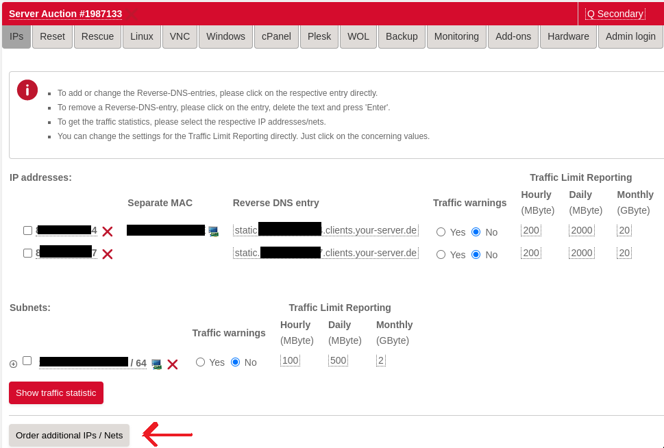
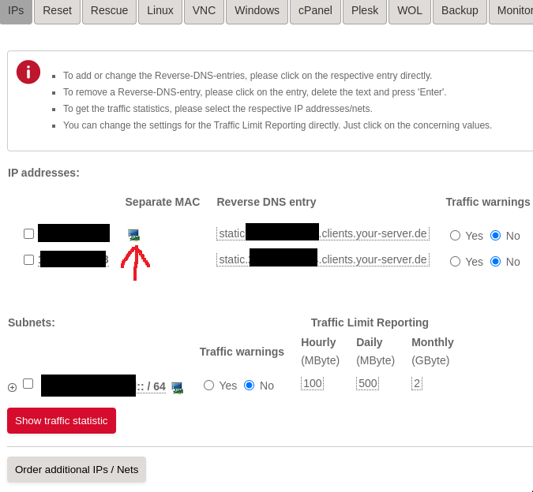

# Table of Contents
- [Overview](#Overview)
- [Get an additional external IP](#get-an-additional-external-ip)
  - [Create a Virtual MAC for the additional IP](#create-a-virtual-mac-for-the-additional-ip)
- [Configure bridged interface on the host](#configure-bridged-interface-on-the-host)
- [Install Qemu](#install-qemu)
- [Configure the VM for computor](#configure-the-vm-for-computor)
- [Configuration inside EFI](#configuration-inside-efi)
- [Install Qubic](#install-qubic-on-the-vm)
- [Access the VM](#accessing-computor-vm)

## Overview
~~Virtualbox has had its chance to prove itself, but failed due to networking issues. It's not surprising why most production workloads use Qemu and not VBox.~~
**I no longer recommend using Qemu due to a bug randomly wrecking the network interface. This happens with both virtio/e1000 emulation. VirtualBox is back to the throne.**

The bridged networking set up could be still useful tho but i don't recommend using software bridge. It's much easier to use macvtap which allows you to keep default Hetzner netplan config
and still allows you to use your additional ip for your computor.

```
sudo ip link add link enp5s0 name macvtap0 type macvtap
sudo ip link set macvtap0 address SE:CO:ND:AR:YM:AC up
ip link show macvtap0
```
Then select bridged in Virtualbox and use the newly created `macvtap0` interface. No further configuration required.

This guide will walk you through the steps to install Qemu in bridged mode using a Hetzner dedicated server with Ubuntu.

## Get an additional external IP

First, order an additional IP for your Hetzner server. It shouldn't break the bank as it only costs a few euros extra per month.
- Go to https://robot.hetzner.com/server and select your server you intend to run your computor on.
- Select the IPs tab (first)
- Click on Order additional IPs / Nets


- Select "One additional IP with costs"
- In the Purpose of use box, say "VM bridged networking"
- Tick agreement
- Apply

Hetzner is usually pretty quick to process the order and provide you the new ip address.

### Create a Virtual MAC for the additional IP
Once you got your additional IP, you will need to create a virtual MAC address for it via the Hetzner Server Robot Web interface. In the IPs tab on your server, the new IP will appear and there will be a small monitor icon next to it. Click on it, and you will be navigated to a page where there will be a button to create the MAC.

Click on the icon where the arrow is pointing to.



## Configure bridged interface on the host
Consider using macvtap interface instead as described below Overview at the top of the page. You won't need to modify any configuration if you go the macvtap route.

Once you have received your additional IP from Hetzner, configure the bridge interface on the host.
Any mistakes here and your server will no longer be accessible and you will have to activate rescue system to recover it so please focus.

Let's assume your Primary IP is 1.1.1.1. This is the IP that was assigned to your server when you ordered it.
Additional IP is 2.2.2.2. Thats your additional IP you received in the previous step.

Complete imaginary example network details for this guide;
- Primary IP: 1.1.1.1
- Gateway for Primary IP: 111.111.111.111
- MAC address for Primary IP: 11:11:a1:b1:c1:d1
- Additional IP: 2.2.2.2
- Gateway for Additional IP: 222.222.222.222
- Virtual MAC for additional IP: 22:22:a2:b2:a2:b2

**To find out your actual gateway which is sometimes the same for both the Primary and Additional IPs, go to https://robot.hetzner.com/server and move your mouse pointer over the ip address. It will show you the details including the Gateway IP.**

**Find out your network interface identifier**:
`cat /etc/netplan/01-netcfg.yaml |grep -A1 ethernets`
You will need to read the second line from the output, which is your network interface.
```
  ethernets:
    enp4s0:
```
So in the case your network interface identifier is `enp4s0`

Now get your MAC address for your primary network interface:
`ethtool -P enp4s0`

Based on the above outputs let's assume the following:
- Network interface identifier: enp4s0
- Primary MAC address: 11:11:a1:b1:c1:d1

Network configuration on Hetzner Ubuntu servers is done via Netplan by default.

**Backup the original netplan configuration so if something goes really wrong, you can easily recover your server by copying your original config back to /etc/netplan/**
`sudo cp /etc/netplan/01-netcfg.yaml /root/01-netcfg.yaml`

The initial network configuration for a Hetzner server will look like this.
`cat /etc/netplan/01-netcfg.yaml`
```
### Hetzner Online GmbH installimage
network:
  version: 2
  renderer: networkd
  ethernets:
    enp4s0:  ## This is your network interface identifier
      addresses:
        - 1.1.1.1/32
        - primary:ipv6:subnet:1111::2/64
      routes:
        - on-link: true
          to: 0.0.0.0/0
          via: 111.111.111.111
        - to: default
          via: fe80::1
      nameservers:
        addresses:
          - 185.12.64.1
          - 2a01:4ff:ff00::add:2
          - 185.12.64.2
          - 2a01:4ff:ff00::add:1
```

To create a bridged interface by modify the netplan configuration to:

`sudo nano /etc/netplan/01-netcfg.yaml`
```
network:
  version: 2
  renderer: networkd
  ethernets:
    enp4s0:
      dhcp4: no
      dhcp6: no
  bridges:
    vmbr0:
      macaddress: 11:11:a1:b1:c1:d1 # PRIMARY MAC ADDRESS
      dhcp4: no
      dhcp6: no
      interfaces: [ enp4s0 ]
      addresses:
        - 1.1.1.1/32 # PRIMARY IP
        - primary:ipv6:subnet:1111::2/64 # Same IPV6 CIDR you had in original config
      routes:
        - on-link: true
          to: 0.0.0.0/0
          via: 222.222.222.222 # Gateway for secondary IP
        - to: 2.2.2.2/32 # Additional IP address
          scope: link
        - to: default
          via: fe80::1
      nameservers: # Same as in original config, dont modify
        addresses:
          - 185.12.64.1
          - 2a01:4ff:ff00::add:2
          - 185.12.64.2
          - 2a01:4ff:ff00::add:1
      parameters:
        stp: false
        forward-delay: 1
        hello-time: 2
        max-age: 12
```

Save the configuration file and run;
`sudo netplan apply`

## Install Qemu
This process has been tested on Ubuntu 22.04
`sudo apt update && sudo apt-get install -y libvirt-daemon libvirt-clients libvirt-daemon-system virtinst ovmf`

As per this guide, you will be streaming the qubic logs into a file which will be accessible from the host.
In order to prevent the log streaming to cut off, you will need to increase the maximum file size in virtlogd.

`sudo nano /etc/libvirt/virtlogd.conf`

Go to the bottom and uncomment the max_size line and set it to 200097152.
`max_size = 200097152`

Restart libvirt, `sudo systemctl restart libvirtd`

## Configure the VM for computor

First, create a virtual image for the guest.
```
qemu-img create qubic.img 12G && \
mkfs.vfat -v -F32 qubic.img && \
fatlabel qubic.img "Qubic" && \
sudo cp qubic.img /var/lib/libvirt/images/
```

Create the VM (the mac address in --network argument should be the MAC address of the additional IP)
```
sudo virt-install \
--name Computor \
--os-variant generic \
--machine q35 \
--boot loader=/usr/share/OVMF/OVMF_CODE_4M.fd,loader.readonly=yes,loader.secure='no',loader.type=pflash,nvram=/usr/share/OVMF/OVMF_VARS.fd \
--memory 115000 \
--vcpus 30 \
--network bridge=vmbr0,model=virtio,mac=22:22:a2:b2:a2:b2 \
--disk /var/lib/libvirt/images/qubic.img,bus=sata \
--serial file,path=/var/log/qubic.log \
--graphics vnc \
--video vga
```

## Configuration inside EFI

In case your network device is not detected automatically by EFI on startup, make sure to run `reconnect -r` first thing you start the EFI shell. It seems to depend on the host hardware, as I only had to do it 1 out of 3 servers. You can automate it by creating a startup.nsh file on fs0:\ (qubic image volume) and insert the command.

My startup.nsh looks as follows:
```
reconnect -r
timezone -s 00:00
ifconfig -s eth0 dhcp
fs0:
```
## Install qubic on the VM

Make sure the VM is always stopped when you mount it's image to the host file-system to avoid data corruption.

Let's assume you have just finished the above step, VM boots the EFI shell but you have nothing on fs0:\.

Stop your VM via `sudo virsh destroy Computor`

Verify computor is not running via `sudo virsh list --all`. It should say stopped.

Create a mount folder for the qubic image;
`sudo mkdir /mnt/qubic`

Mount VM image to local file-system;
`sudo mount /var/lib/libvirt/images/qubic.img /mnt/qubic`

Now you can copy compiled qubic.cpp, current spectrum and whatever you need.
eg.: `sudo cp /home/mrcomputor/qubic-1.107.2.efi /mnt/qubic/Qubic.efi`

Once you've finished;
`sudo umount /mnt/qubic`

That's the same flow I use when i update my computor;
- Gracefully exit qubic within the VM by hitting ESC
- Stop the vm via virsh destroy
- Mount to file-system
- Copy new efi executable, overwriting the old one.
- umount /mnt/qubic
- Start VM

## Accessing Computor VM
With the above configuration you are able to access the UEFI terminal via VNC and you can read the output (including Qubic logs) via `sudo tail -f /var/log/qubic.log`

The easiest way to access the graphical interface of the VM is to install `virt-manager` where you want to access it form.

virt-manager is a linux client to access the libvirt daemon (service that provisions qemu VMs). It's possible to run virt-manager on Windows but I don't use Windows so i'm not going into details. Here is an article that describes the process https://linux.how2shout.com/how-to-install-and-use-virt-manager-on-windows-10/

Alternatively, if you don't want to use virt-manager for any reason, you can just use VNC but you need to set up an SSH tunnel to your host and access the VNC server via localhost. Never allow connections to VNC server from other than localhost, because it's unsecure.

Install virt-manager on the machine you want to access the VM from.
`sudo apt install virt-manager`

- Open virt-manager
- Click File -> Add connection...
- Tick the box for Connect to remote host over SSH (you dont need it if you run virt-manager on host)
- Enter the username you have set up on your Hetzner server
- Enter the hostname/primary ip address of your Hetzner server
- Connect

You shouldn't use password to connect to your server, but SSH key instead. I assume it's already been set up for you.

Another alternative approach is to set up graphical interface on your Hetzner server and run virt-manager there. I'm not supporting it, because it causes unnecessary load on your server and potentially stealing CPU time from your VM.
